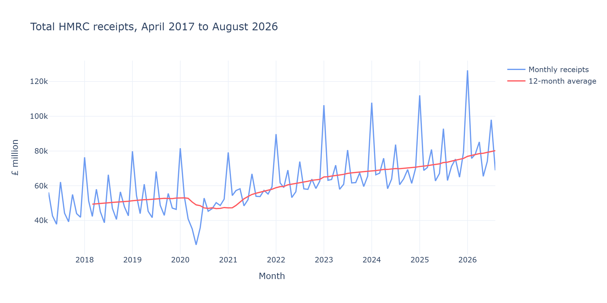
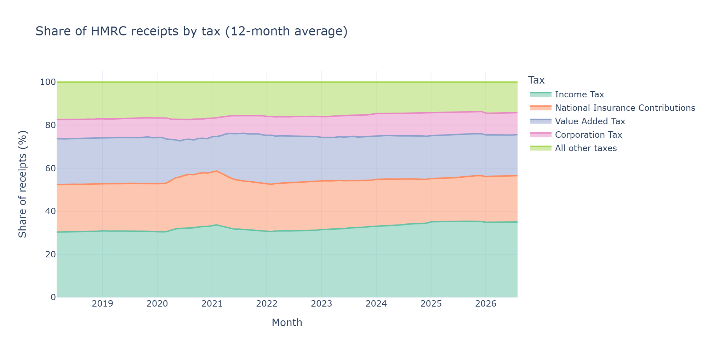
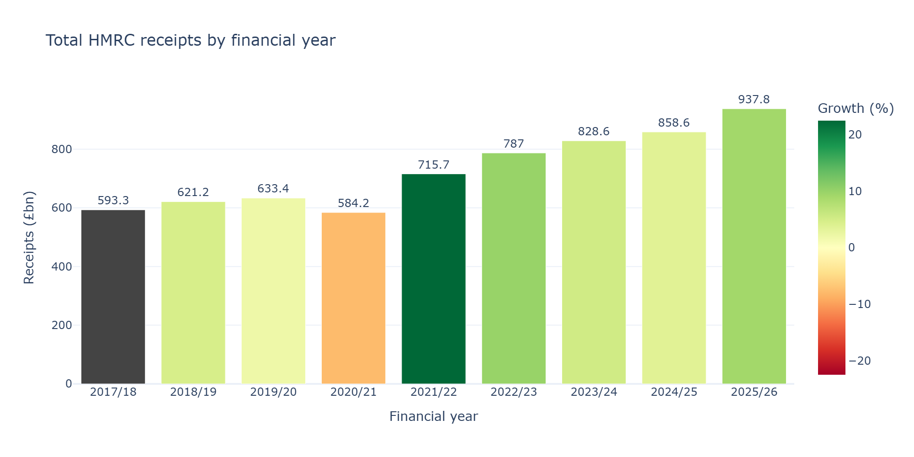

# 💷 HMRC Tax Receipts Analysis
![HMRC POJECT BANNER]

Analysing UK tax and National Insurance receipts to spot patterns, test ideas and predict future receipts.

## 🎯 Purpose
HMRC publishes how much tax the UK collects every month. I want to turn those numbers into clear insights about which taxes bring in the most money and when.

## 👥 Audience
- 🏛️ Policy and finance teams who need to understand tax trends
- 📊 Analysts who want a clean, repeatable analysis

## 🏁 Goals
- 🧹 Clean and prepare the HMRC data (ETL)
- 🔍 Explore patterns over time (EDA)
- 📐 Test hypotheses with statistics
- 🤖 Build a machine learning model to predict receipts
- 📈 Share findings in an interactive Power BI dashboard

## 📥 Dataset
**HMRC tax and NICs receipts for the UK (monthly bulletin)**, published on GOV.UK.

## 🛠️ Tools
Python · pandas · SciPy · scikit-learn · Jupyter · Power BI · Git and GitHub

## 🗂️ Project structure
```
hmrc-tax-analysis/
├── data/raw/         original HMRC files
├── data/processed/   cleaned data
├── notebooks/        ETL, EDA, statistics, ML
├── docs/             notes and documentation
└── outputs/          charts and results
```
## 🧹 Data preparation (ETL)
The raw HMRC file needed tidying before analysis:
- 🔚 Removed a footer row that wasn't real data
- 🔢 Converted numbers stored as text into real numbers
- ❌ Turned `[X]` (not available) into proper empty values
- 📅 Converted months into real dates
- 🗑️ Dropped two columns that were empty in every month

**Result:** 113 months × 45 columns, April 2017 to August 2026, saved as `data/processed/hmrc_clean.csv`.

## 🔍 Key findings from the exploration
- 💷 Income Tax is the biggest single tax, at about £20bn a month
- 📅 January is the busiest month, about 54% above a typical month
- 🗓️ VAT and Corporation Tax arrive in quarterly waves
- 📈 Receipts grew from £593bn (2017/18) to £938bn (2025/26)
- 🦠 The Covid year (2020/21) saw a 7.8% fall, followed by a 22.5% rebound
- 🔗 Income Tax and National Insurance move closely together (0.82)
## 📊 Charts




📓 Details: [02_eda.ipynb](notebooks/02_eda.ipynb)

📓 Full details: [01_etl.ipynb](notebooks/01_etl.ipynb)
## 🔬 Hypotheses
*To be added after exploring the data.*

## 📈 Results and conclusions
*To be added when the analysis is complete.*

## 🧱 Project management
Work is planned on a GitHub Kanban board, using MoSCoW priorities.# hmrc-tax-analysis
Analyzing UK HMRC Tax &amp; NICs receipts with ML modeling and Power BI.
